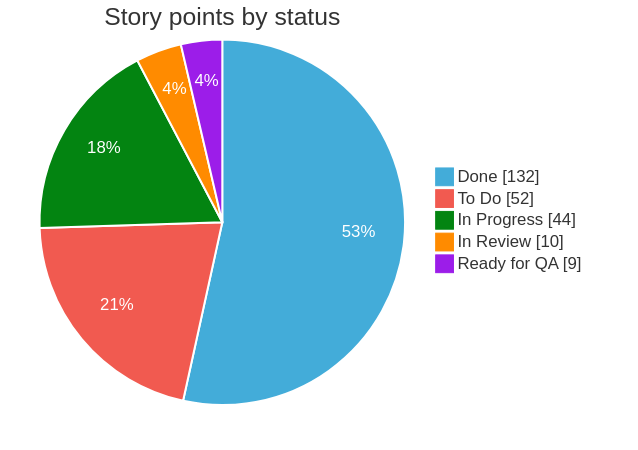
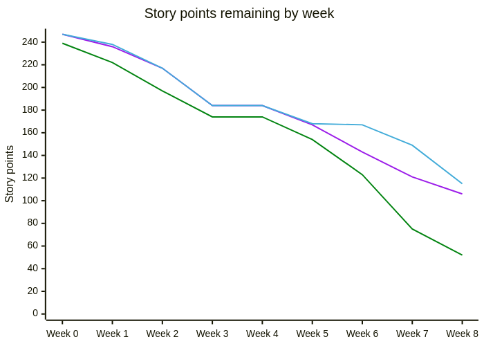
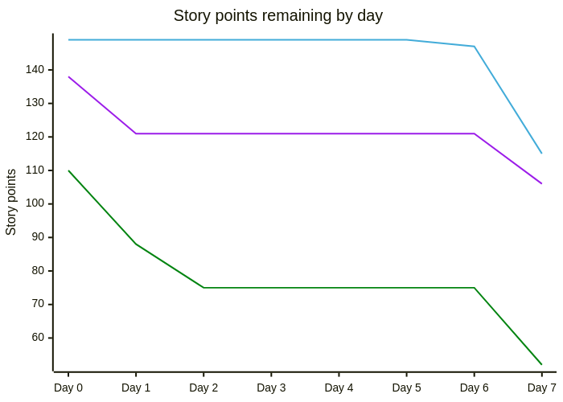

# action-jira-story-point-charts

Generate story point charts from Jira issues and post them to a slack channel.

These are examples of what the charts posted may look like:





- The blue lines show the remaining story points that have not been completed (i.e. made it to `Done` status).
- The purple lines show the remaining story points that have not been developed (i.e. made it to `In Review` or `Ready for QA` status).
- The green lines show the remaining story points that have not been started (i.e. made it to `In Progress` status).

## Installation

Add a step like this to a github action workflow e.g. a file at `.github/workflows/chart-bot.yml`:

```yaml
name: chart-bot

on:
  workflow_dispatch:
    inputs:
      slack-channel:
        description: Slack channel id

  # Run at 6.30pm SGT (10.30am UTC) Monday to Friday
  schedule:
    - cron: '30 10 * * 1-5'

concurrency:
  group: ${{ github.workflow }}-${{ github.event.pull_request.number || github.ref }}
  cancel-in-progress: true

jobs:
  chart-bot:
    runs-on: ubuntu-latest

    steps:
      - uses: insidewhy/action-jira-story-point-charts@v0
        with:
          jira-token: ${{ secrets.JIRA_TOKEN }}
          jira-user: ${{ secrets.JIRA_USER }}
          jira-base-url: https://myjiraurl.atlassian.net
          slack-channel: ${{ github.event.inputs.slack-channel || 'C42PZTP3ECZ' }}
          slack-token: ${{ secrets.SLACK_TOKEN }}
          story-point-estimate: 5
```

- The `JIRA_TOKEN` github secret should be a personal Jira token.
- The `JIRA_USER` secret should be the email of the Jira user that created this token.
- The `story-point-estimate` is the story points to assign to any issue where the `Story Points` field is unset, if omitted then any issue with an unset story points field will be assumed to be worth 0 story points.
- The `SLACK_TOKEN` secret should be the `Bot User OAuth Token` of a slack app which must be created and installed in the slack workspace. This token must have `files:write` and `chat:write` permissions. The app bot must be invited to a channel to be able to post charts to it.

The slack channel ID must be given in `slack-channel` rather than the name of the channel, this can be retrieved by clicking on the channel name in slack.

This configuration shows how to trigger the workflow at specific times and manually, this manual trigger configuration allows the channel to be overridden.
To trigger the workflow manually using the configuration above `github-cli` could be used:

```bash
gh workflow run chart-bot -f slack-channel C52ZZTO9EAA
```

### Advanced configuration

The fields used to determine the story points, start time, and development complete time can be overriden in the `with` fields. The following shows the defaults:

```yaml
jira-fields: |
  storyPoints: story points
  devCompleteTime: development complete time
  startTime: start time
```

Note the `|` in the `yaml`, this is because github only supports string action fields so a "yaml like" string must be sent to the action.

The `resolutiondate` field is used to determine when an issue is completed, but the `Start Time` and `Development Complete Time` fields are not available by default.
If you would appreciate the green and purple lines in your jira charts then custom fields will need to be created, it is recommended to automatically update these fields when transitions occur, this can be configured by attaching actions to various workflow transitions in the jira UI.

## Testing the script locally

There are unit tests:

```bash
pnpm test
```

Or an end-to-end test by creating an environment file at `.env.test` such as:

```
INPUT_SLACK-CHANNEL=C0962KJPUPM
INPUT_STORY-POINT-ESTIMATE=5
INPUT_JIRA-USER=my@email.sg
INPUT_JIRA-BASE-URL=https://aproject.atlassian.net
INPUT_JIRA-TOKEN=my_jira_token_goes_here
INPUT_SLACK-TOKEN=my_slack_token_goes_here
```

Then run:

```
pnpm local-test
```
