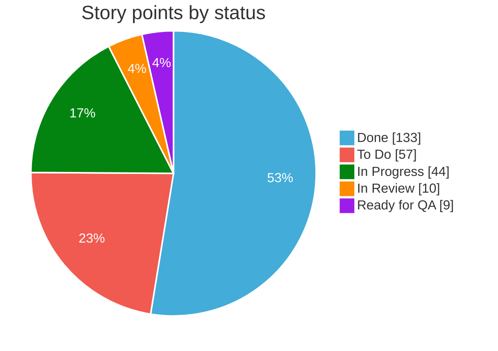
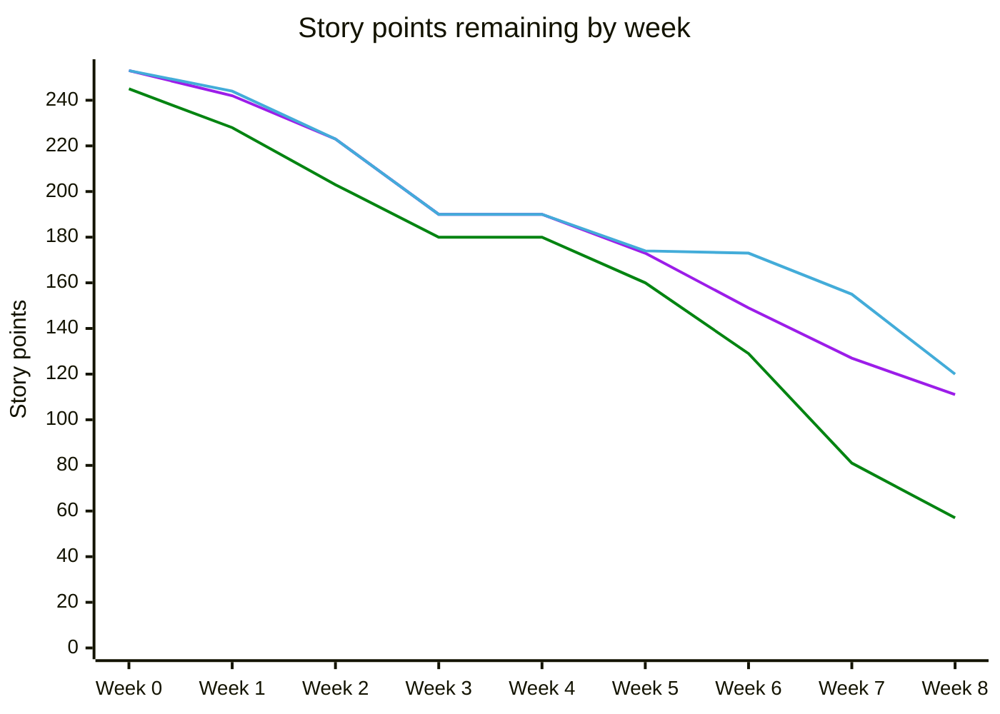
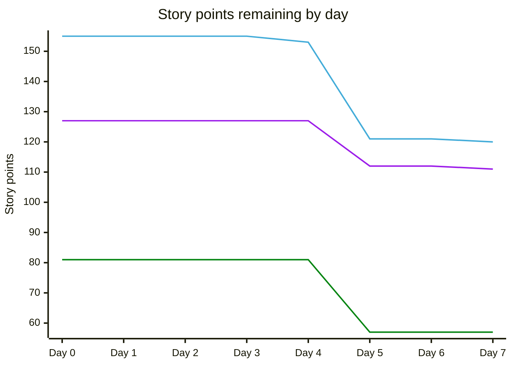
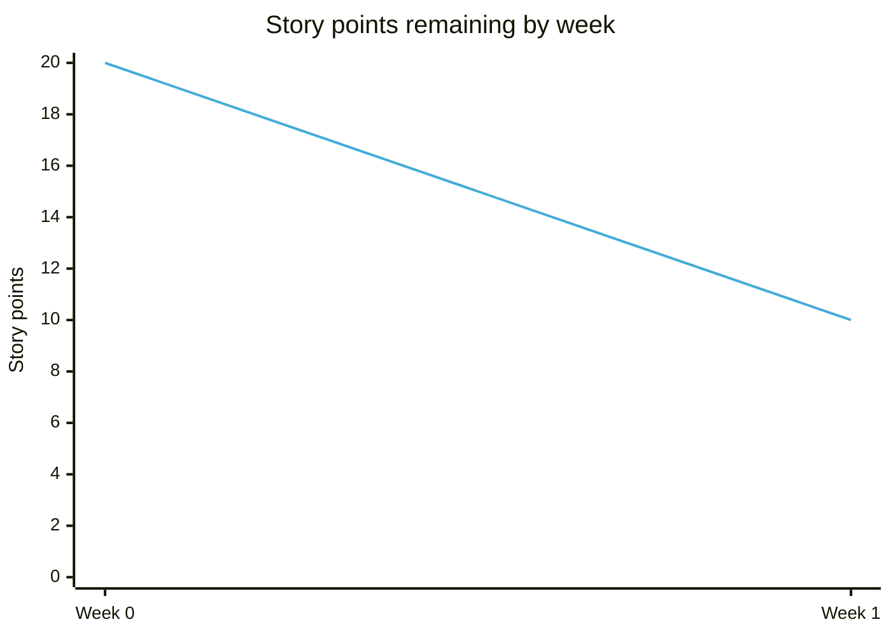
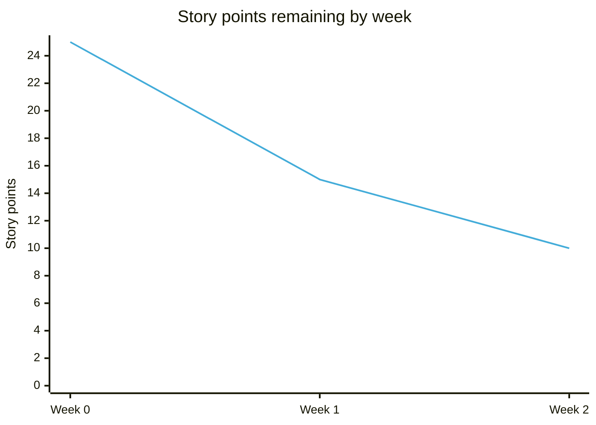
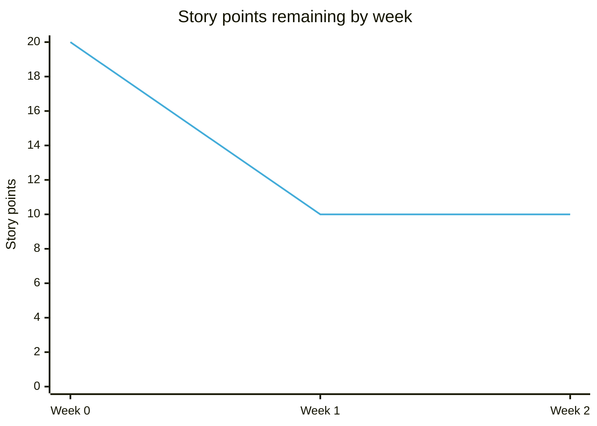

# action-jira-story-point-charts

A github action to generate story point charts from Jira issues and post them to a slack channel.

These are examples of what the charts posted may look like, although note that this project uses [pisnge](https://github.com/insidewhy/pisnge), a rust port of mermaid with slightly prettier charts, and the examples below are generated with mermaid:







- The blue lines/segments show the remaining story points that have not been completed (i.e. made it to `Done` status).
- The purple lines/segments show the remaining story points that have not been developed (i.e. made it to `In Review` or `Ready for QA` status).
- The green lines/segments show the remaining story points that have not been started (i.e. made it to `In Progress` status).

```mermaid
%%{init: {'theme': 'base', 'themeVariables': {"xyChart":{"plotColorPalette":"#ff8b00, #9c1de9", "plotReservedSpacePercent": 0}}}}%%
xychart-beta
  title "Issues in review or ready for QA"
  x-axis [PJ-42, PJ-19, PJ-6, PJ-14, PJ-16]
  y-axis "Number of days in status" 0 --> 4
  bar [4, 3.5, 3, 1, 0]
  bar [1.5, 3, -1, 0.2, 0.5]
```



- The purple bars represent the number of days that issues have been ready for QA.
- The orange bars represent the number of days that issues have been in review.

## Installation

Add a step like this to a github action workflow e.g. a file at `.github/workflows/chart-bot.yml`:

```yaml
name: chart-bot

on:
  workflow_dispatch:
    inputs:
      slack-channel:
        description: Slack channel id

  # Run at 6.30pm SGT (10.30am UTC) Monday to Friday
  schedule:
    - cron: '30 10 * * 1-5'

concurrency:
  group: ${{ github.workflow }}-${{ github.event.pull_request.number || github.ref }}
  cancel-in-progress: true

jobs:
  chart-bot:
    runs-on: ubuntu-22.04

    steps:
      - uses: insidewhy/action-jira-story-point-charts@v1
        with:
          jira-token: ${{ secrets.JIRA_TOKEN }}
          jira-user: ${{ secrets.JIRA_USER }}
          jira-base-url: https://myjiraurl.atlassian.net
          slack-channel: ${{ github.event.inputs.slack-channel || 'C42PZTP3ECZ' }}
          slack-token: ${{ secrets.SLACK_TOKEN }}
          story-point-estimate: 5
```

- The `JIRA_TOKEN` github secret should be a personal Jira token.
- The `JIRA_USER` secret should be the email of the Jira user that created this token.
- The `story-point-estimate` is the story points to assign to any issue where the `Story Points` field is unset (`0` is not considered unset, the jira field must be null). If omitted then any issue with an unset story points field will be assumed to be worth 0 story points.
- The `SLACK_TOKEN` secret should be the `Bot User OAuth Token` of a slack app which must be created and installed in the slack workspace. This token must have `files:write` and `chat:write` permissions. The app bot must be invited to a channel to be able to post charts to it.

The slack channel ID must be given in `slack-channel` rather than the name of the channel, this can be retrieved by clicking on the channel name in slack.

This configuration shows how to trigger the workflow at specific times and manually, this manual trigger configuration allows the channel to be overridden.
To trigger the workflow manually using the configuration above `github-cli` could be used:

```bash
gh workflow run chart-bot -f slack-channel=C52ZZTO9EAA
```

### Extra configuration

#### charts

This determines which charts should be created and in which order they should be posted.
The following shows the defaults:

```yaml
charts: remaining-by-day by-status remaining-by-week in-review-and-test weekly-velocity
```

There are additional `velocity-by-developer`, `velocity-by-developer-this-week` and `velocity-by-developer-last-week` charts available which are not produced by default.
These charts need `developer` and `dev-complete-time` field configurations.

#### jira-fields

The fields used to determine the `story points`, `start time`, and `development complete time` of an issue can be overriden by action inputs.
The following shows the defaults:

```yaml
jira-fields: |
  story-points: story points
  dev-complete-time: development complete time
  ready-for-review-time: ready for review time
  start-time: start time
  end-time: resolutiondate
  developer: developer
```

Field names in the config are matched to those in Jira using a case-insensitive comparison.

Note the `|` in the `yaml`, this is because github only supports string action fields so a "yaml like" string must be sent to the action.

The `resolutiondate` field is used to determine when an issue is completed, but the `Start Time`, `Ready For Review Time` and `Development Complete Time` fields are not available by default.
If the green, orange and purple lines would be appreciated then custom fields will need to be created, it is recommended to automatically update these fields when transitions occur, this can be configured by attaching actions to various workflow transitions in the Jira workflow configuration UI.

The `developer` field is only used by the `velocity-by-developer`, `velocity-by-developer-this-week` and `velocity-by-developer-last-week` charts.

#### jira-statuses

The various status names and colors can be overridden by action inputs. The following shows the defaults:

```yaml
jira-statuses: |
  draft: draft #8fa3bf
  blocked: blocked #ff1493
  todo: to do #f15a50
  in-progress: in progress #038411
  in-review: in review #ff8b00
  ready-for-qa: ready for qa #9c1de9
  in-test: in test #4b0082
  done: done #43acd9
```

For each status, just the status name can be overridden, just the color can be overridden, or both the color and the status can be overridden:

```yaml
jira-statuses: |
  done: Complete
  in-progress: #f9f9f9
  ready-for-qa: Ready for Test #aaaaaa
```

Statuses in the config are matched to those in Jira using a case-insensitive comparison.

#### jql

By default the jql query for selecting issues is `fixVersion = earliestUnreleasedVersion()`.
This can be overridden using the `jql` input:

```yaml
jql: fixVersion = "release-1.0"
```

#### Summary

Optional summary text can also be attached to the slack message containing the charts:

```yaml
summary: These are the charts
```

#### Textual descriptions

A textual description containing the point changes for the week and/or day can be added to the slack message containing the charts.

```yaml
with-daily-description: Daily description heading
with-weekly-description: Weekly description heading
```

This report will look something like this:

```
To Do:                 83 [15%] ->  32 [  6%] (-51 [ -9%]) - Mean Velocity: 30.7
Not Yet In Review:    111 [20%] ->  48 [  9%] (-63 [-11%]) - Mean Velocity: 31.6
Not Yet Ready for QA: 112 [20%] ->  56 [ 10%] (-56 [-10%]) - Mean Velocity: 29.7
Unfinished:           239 [43%] -> 158 [ 28%] (-81 [-15%]) - Mean Velocity: 22.7
Total:                528 [95%] -> 556 [100%] (+28 [ +5%])
```

#### Textual descriptions with ticket changes

Information regarding tickets changes can be produced in the textual report and would look something like this:

```
PJ-123: Not Existing -> Ready for QA - Story points [0 ->  2]
PJ-125: Ready for QA -> In test      - Story points [1 ->  1]
PJ-479: To Do        -> To Do        - Story points [3 ->  5]
PJ-251:        To Do -> Deleted      - Story points [1 ->  0]

Total Story Point Change: +3
```

It is possible to retrieve ticket changes over time using the jira APIs but this involves one API call per ticket which can slow down the report generation and can easily exceed the jira API rate limit of 500 requests per five minutes.

To work around this the action can store ticket data each time it is run, if running the report at the same time each day/week then the previous day or week's ticket data is suitable to generate a report showing how tickets have changed since the last day/week.

The `with-daily-changes` and `with-weekly-changes` options can be used to add this data to the ticked description report and will cause the action to store data in a directory structure so historical data can be read for each day.
This options should be passed a path to store/read the historic data from e.g.

```yaml
with-daily-changes: /tmp/action-jira-story-points-chart-data
with-weekly-changes: /tmp/action-jira-story-points-chart-data
```

When this configuration is used then this data should be persisted across actions, neither github artifacts or github caching is suitable to store this data, AWS S3 or equivalent could be one choice to store this data.
The following steps could be used in a github action workflow to load and persist the data from S3:

```yaml
name: chart-bot

on:
  workflow_dispatch:
    inputs:
      slack-channel:
        description: Slack channel id

  # Run at 6.30pm SGT (10.30am UTC) Monday to Friday
  schedule:
    - cron: '30 10 * * 1-5'

concurrency:
  group: ${{ github.workflow }}-${{ github.event.pull_request.number || github.ref }}
  cancel-in-progress: true

jobs:
  chart-bot:
    runs-on: ubuntu-22.04
    permissions:
      id-token: write
      contents: read

    steps:
      - uses: aws-actions/configure-aws-credentials@v4
        with:
          role-to-assume: arn:aws:iam::${{ secrets.AWS_ACCOUNT_ID }}:role/github-action-data-bucket-uploader
          aws-region: ap-southeast-1

      - name: Sync chartbot action data from s3
        run: aws s3 sync s3://${{ secrets.ACTION_DATA_S3_BUCKET }}/action-jira-story-points-chart-data/ /tmp/action-jira-story-points-chart-data

      - uses: insidewhy/action-jira-story-point-charts@v1
        with:
          jira-token: ${{ secrets.JIRA_TOKEN }}
          jira-user: ${{ secrets.JIRA_USER }}
          jira-base-url: https://myjiraurl.atlassian.net
          slack-channel: C42PZTP3ECZ
          slack-token: ${{ secrets.SLACK_TOKEN }}
          story-point-estimate: 5
          with-daily-description: '*Daily Report*'
          with-weekly-description: '*Weekly Report*'
          with-daily-changes: /tmp/action-jira-story-points-chart-data
          with-weekly-changes: /tmp/action-jira-story-points-chart-data

      - name: Sync chartbot action data to s3
        if: github.event_name == 'schedule'
        run: aws s3 sync /tmp/action-jira-story-points-chart-data s3://${{ secrets.ACTION_DATA_S3_BUCKET }}/action-jira-story-points-chart-data
```

This [example terraform configuration](./etc/terraform.tf) could be used to create a bucket which can be used in the above configuration (with the `locals` amended to match the secret `ACTION_DATA_S3_BUCKET` and the path to the github project).

## Testing the action locally

There are unit tests:

```bash
pnpm test
```

Or an end-to-end test can be run by creating an environment file at `.env.test` such as:

```
INPUT_SLACK-CHANNEL=C0962KJPUPM
INPUT_STORY-POINT-ESTIMATE=5
INPUT_JIRA-USER=my@email.sg
INPUT_JIRA-BASE-URL=https://aproject.atlassian.net
INPUT_JIRA-TOKEN=my_jira_token_goes_here
INPUT_SLACK-TOKEN=my_slack_token_goes_here
```

Then run:

```
pnpm local-test
```

## Philosophy

Consider the following releases chart at week one, at this time there were 20 story points in the release on day 0 and 10 story points remaining at the end of the week:



During week two an additional 5 story points were added to the release and 5 story points were completed, now the chart looks like this:



The chart considers that all story points that are currently in the release were there from day 0, while this misses data about how and when story points were added to a release, it allows the rate of progress to be accurately measured.
If the chart instead showed story points being added and removed the chart would look like this:



The 5 story points being added and the 5 story points completed during week two lead to a flat line, from the above chart it's impossible to know what occurred between the following two scenarios:

- The team completed no work
- The team did some work but an equal amount of work was added to the release.

Perfect information is rarely available from the beginning of a release.
It is hard for many teams to accurately track what work should be present in a sprint before it begins let alone an entire release, this often leads to sprint burn down charts that remain flat or increase over time.
By considering that the current story points in a release should always have been there, this can lead to more accurate tracking of progress towards completion.
Given that charts are being posted on a recurring basis into one or more slack channels, information about story points being added to a release can still be determined by comparing charts or the `with-weekly-description`/`with-weekly-changes` and/or `with-daily-description`/`with-daily-changes` option pairs can be used to add information about story point changes to the textual report.
